# RoboSIKG Architecture

This diagram is designed for GitHub Markdown (Mermaid enabled).

```mermaid
flowchart LR
  %% ---------- Inputs ----------
  MP4[MP4 Input\n`ingest/mp4.py`]
  ROS2["ROS2 Stream (optional)\n`ingest/ros2_stub.py`"]
  ISAAC["Isaac Sim / Replicator (deferred)"]

  %% ---------- Control Plane ----------
  WEB[Ops Console UI\nFastAPI + WebSocket\n`web/app.py`]
  RUN[scripts/run_demo.py\nor /api/run]

  %% ---------- Core Pipeline ----------
  ORCH[Orchestrator\n`agent/orchestrator.py`]
  ING[Ingest + Timestamping\nsample_fps / max_frames]
  ID[Canonical IDs\nSHA-256 URNs\n`ids/*`]
  DET[Perception\nTorchVision detector + masks\n`perception/torch_detector.py`]
  TRT["TensorRT Path (stub)\n`perception/tensorrt_stub.py`"]
  MOT[Tracking\nKalman + association\n`tracking/*`]
  EMB[Embedding + Routing\n`vector/embedder.py` + `vector/routing.py`]
  VDB[FAISS Vector Memory\n`vector/faiss_store.py`]
  KG[RDF KG Store\ntriples + ontology\n`kg/store.py`]
  SPQ[SPARQL Query Layer\n`kg/queries.py` + `/api/sparql/query`]
  REASON[Reasoning Broker\nauto / nim / mock]
  NIM[NVIDIA NIM\nCosmos Reason 2\nOpenAI-compatible API]
  MOCK[Deterministic Mock Reasoner]
  FALLBACK[Deterministic Fallback/Consultant\ngeometry + ANN neighbors\ntrajectory completion]

  %% ---------- Outputs ----------
  TTL[graph.ttl]
  NT["graph.nt (sorted)"]
  SUM[run_summary.json]
  DBG[reasoning_debug.jsonl]
  EVAL[eval_report.json]
  EXP[Export bundles\n`out_web_exports/`]

  %% ---------- Flows ----------
  MP4 --> RUN
  ROS2 --> RUN
  ISAAC -. future input .-> RUN
  WEB -->|Run config / upload / controls| RUN
  RUN --> ORCH

  ORCH --> ING
  ING --> ID
  ING --> DET
  DET --> MOT
  DET --> ID
  MOT --> ID
  DET -. accel path .-> TRT

  DET --> EMB
  MOT --> EMB
  EMB --> VDB

  ID --> KG
  DET --> KG
  MOT --> KG

  KG --> SPQ
  WEB <-->|Graph / overlays / SPARQL / status| KG
  WEB <-->|Live updates `/ws/live`| ORCH

  KG --> REASON
  VDB --> REASON
  MOT --> REASON
  REASON -->|nim mode| NIM
  REASON -->|mock mode| MOCK
  NIM --> REASON
  MOCK --> REASON
  REASON --> FALLBACK
  FALLBACK --> KG
  REASON --> KG

  KG --> TTL
  KG --> NT
  ORCH --> SUM
  ORCH --> DBG
  SUM --> EVAL
  WEB --> EXP

  %% ---------- NVIDIA styling ----------
  classDef nvidia fill:#76B900,stroke:#1B1F23,color:#111,stroke-width:1.5px;
  classDef core fill:#E9F2FF,stroke:#3B82F6,color:#111;
  classDef io fill:#FFF7E6,stroke:#F59E0B,color:#111;
  classDef out fill:#ECFDF3,stroke:#10B981,color:#111;

  class NIM,TRT nvidia;
  class ORCH,ING,ID,DET,MOT,EMB,VDB,KG,SPQ,REASON,FALLBACK core;
  class MP4,ROS2,ISAAC,WEB,RUN io;
  class TTL,NT,SUM,DBG,EVAL,EXP out;
```

## Notes for Presentation

- NVIDIA path is explicit: `Reasoning Broker -> NVIDIA NIM (Cosmos Reason 2)`.
- GPU acceleration path is explicit: perception runtime with TensorRT extension point.
- Deterministic trust path is explicit: canonical SHA-256 URNs, sorted `graph.nt`, deterministic fallbacks.
- Product surface is explicit: Ops Console, SPARQL, overlays, exports, and live WebSocket telemetry.
